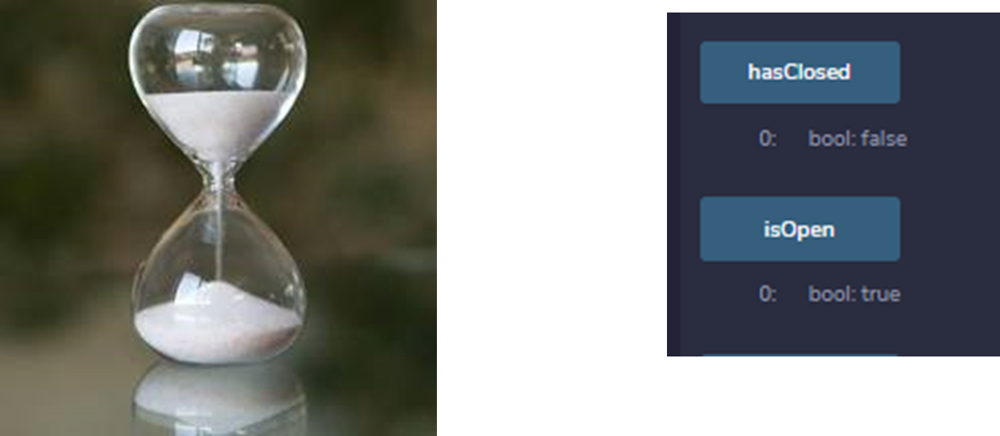

# Homework 21: You sure can attract a crowd!

## Deploying the CrowdSale Contracts

**1.	Set the network as Kovan**

**2.	Deploy CrowdSale Contract**

After compiling the files, we deploy the Pupper Coin CrowdSale Deployer
* We determine the name and symbol of the coin, the wallet behind it as well as the initial supply and the goal, which is set to be the same as the cap.

After hitting confirm in MetaMax, we have successfully deployed the contract with the various contracts that, after being deployed, will allow us to create the coin and make coin sales.

**3.	Deploy Pupper Coin Contract**

From the contract deployed in the prior step we will use the token address generated to input in this step. 

**4.	Deploy Pupper Coin Sale Contract**

From the first contract deployed, we will use the token sale address generated to input in this step. 

Before we move to the next step, we confirm that all the contracts have been deployed: 

## Buying ARGIE

**1.Buying the New Coin at the Crowd Sale**
We will buy from a different account to the account that created the coin, 0.05 ETH + 1 WEI to hit the goal and bet the ranch.

**2. And now, we wait until the crowd sale finishes**

**3. We can now finalize the auction and claim our token**

**4. Add Token to the Wallet and wait until we see the balance!**

And this is how we successfully sold 0.05 ETH (less than the required amount but due to limited ETH available in the multiple accounts) of ARGIE.
